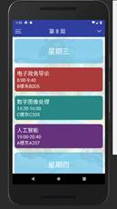
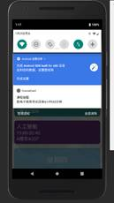

# 编写目的
方便老师和助教了解此项目
# 背景
中大app经常会出现打不开的现象，所以我们就设计了这个软件，用户可以通过中大教务系统导入课程表，在日常生活中方便地查询每日课程。
# 运行环境
最少需要Android8.0以上的系统
# 程序描述
CourseCard有课程提醒功能和备注功能，可以帮助用户合理安排时间。我们还留了一个彩蛋，如果用户足够幸运的话，还有机会在课程信息界面偶遇可爱的冈布奥。其特点是当前日期始终在顶部，可以转换不同的周数，查看课程，具有课程提醒以及在第二次打开软件时，实现自动跳转到当天。
# 数据库设计（er图）

# UI设计
- 登陆界面 
   
- 课表界面 
   
- 课程详细信息界面 
   
# 功能(ipo图)

# 流程逻辑

