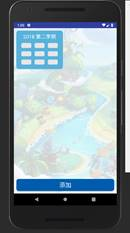
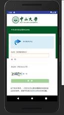
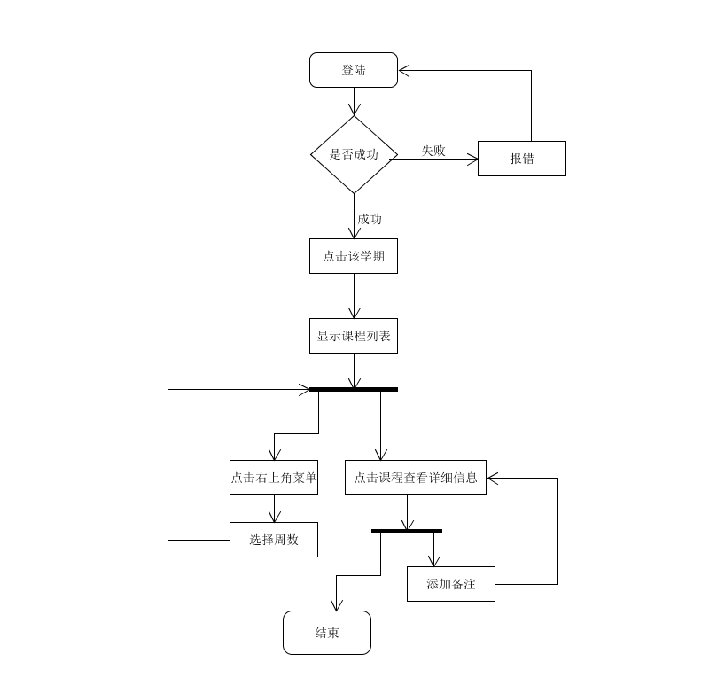

# 编写目的
方便老师和助教了解此项目
# 背景
中大app经常会出现打不开的现象，所以我们就设计了这个软件，用户可以通过中大教务系统导入课程表，在日常生活中方便地查询每日课程。
# 运行环境
最少需要Android8.0以上的系统
# 程序描述
- CourseCard有课程提醒功能和备注功能，可以帮助用户合理安排时间。我们还留了一个彩蛋，如果用户足够幸运的话，还有机会在课程信息界面偶遇可爱的冈布奥。其特点是当前日期始终在顶部，可以转换不同的周数，查看课程，具有课程提醒以及在第二次打开软件时，实现自动跳转到当天。
- 使用mvc三层架构：MVC，全称Model View Controller，即模型-视图-控制器；
  - Model（模型）：
是Web应用中用于处理数据逻辑的部分，包括Service层和Dao层；
Service层用于和数据库联动，放置业务逻辑代码，处理数据库的增删改查，
Dao层用于放各种接口，以备调用；

  - View（视图）：
是Web应用中处理响应给客户的页面的部分，例如我们写的html静态页面，jsp动态页面，这些最终响应给浏览器的页面都是视图；
通常视图是依据模型数据来创建的；

  -  Controller（控制器）：
在Web应用中，简而言之，就是Servlet，或者SpringMVC框架中加了注解@Controller的方法（实际上一个方法就相当于一个对应的Servlet）；

# 数据库设计（er图）
- 目录 

- 代码 
构建：

接口：

# UI设计
- UI设计目录与所用函数 

- 登陆界面 
   
- 课表界面 
   
- 课程详细信息界面 
   
# 功能(ipo图)
- 代码 
数据获取与转换

# 流程逻辑

