

# 应用简介

CourseCard是一款课程表应用。用户可以通过中大教务系统导入课程表，在日常生活中方便地查询每日课程。除此之外，CourseCard还有课程提醒功能和备注功能，可以帮助用户合理安排时间。我们还留了一个彩蛋，如果用户足够幸运的话，还有机会在课程信息界面偶遇可爱的冈布奥。

# 使用要求

经测试，要求至少Android8.0以上的系统，8.1以上100%可以跑，8.0随缘，往下基本没戏……

# 使用说明

用户首次打开应用时，课程列表为空，点击左上角的列表按钮跳转到学期列表界面。点击下方的添加按钮，弹出学期菜单，选择学期后添加到学期列表。

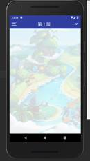 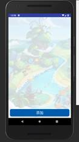 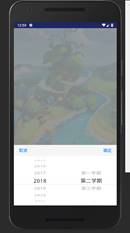 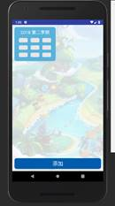

点击添加的学期，跳转到中央身份验证服务页面，输入NetID和密码，如果身份错误会报错；

验证成功就能获取该学期课程信息。再次点击该学期，跳转到课程列表，显示一周之内的课程信息，上下滑动查看，当前日期始终悬浮在顶部。点击右上角下拉菜单，选择周数并跳转。

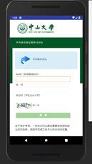 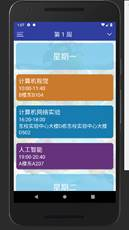 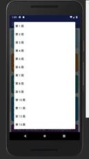 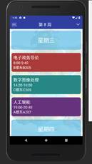

点击课程可以查看详细信息，点击横线编辑备注，写好备注之后点击空白区域完成更新。只要该课程添加了备注，在任意一周都可以查看到备注信息。退出应用再次打开时，会自动跳转到当天对应的日期，并在通知栏显示课程提醒。

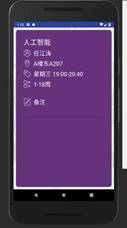 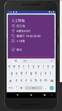 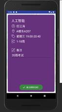 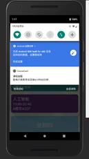

最后，用户进入课程信息界面时，有机会见到不同的冈布奥。

    

# 小组成员
- 韩俊柠 16340068
- 冯扬 16340060
- 郭弘 16340066
- 谷田 16340065
- 巩文骏 16340062

# 小组分工

- UI界面设计：韩俊柠 谷田
- 数据库设计： 冯扬
- 逻辑设计： 郭弘 巩文骏

